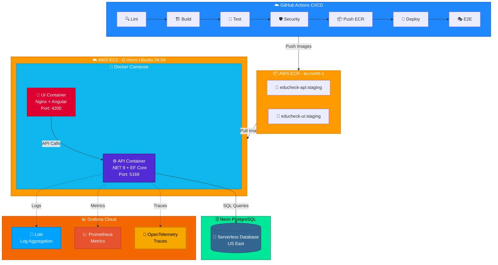
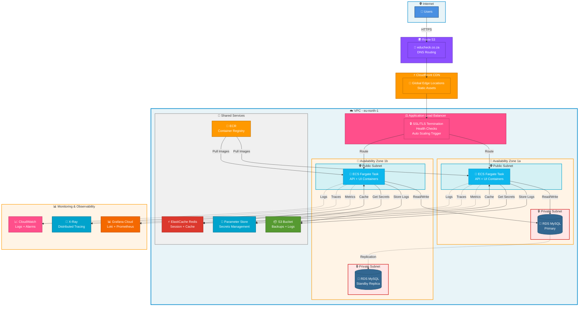

# EduCheck - Higher Education Fraud Detection Platform

[](http://16.170.145.114:4200)
[](https://github.com/vtl-28/EduCheck/actions)
[](https://dotnet.microsoft.com/)
[](https://angular.dev/)
[](https://neon.tech/)

> **Live Staging Environment:** [http://16.170.145.114:4200](http://16.170.145.114:4200)

A production-ready platform for South African students to verify the accreditation status of higher education institutions and report fraudulent organizations. Built with enterprise-grade CI/CD, containerization, and comprehensive testing.

---

## 📋 Table of Contents

- [Overview](#overview)
- [Key Features](#key-features)
- [Tech Stack](#tech-stack)
- [Architecture](#architecture)
- [Live Demo](#live-demo)
- [CI/CD Pipeline](#cicd-pipeline)
- [Testing Strategy](#testing-strategy)
- [Infrastructure](#infrastructure)
- [Security](#security)
- [Local Development](#local-development)
- [Project Status](#project-status)
- [What I Learned](#what-i-learned)

---

## 🎯 Overview

**Problem Statement:** South African students face significant risks from unaccredited institutions that offer worthless qualifications. The government's accreditation database (DHET) is difficult to navigate and doesn't provide a mechanism for reporting suspicious institutions.

**Solution:** EduCheck provides an intuitive interface to search accredited institutions and enables students to report fraudulent organizations. Admins can review and verify fraud reports, creating a community-driven fraud detection system.

**Target Users:**
- **Students:** Search institutions, verify accreditation status, report fraud, locate nearby accredited institutes
- **Admins (DHET Officials):** Review fraud reports, manage verification status

---

## ✨ Key Features

### For Students
- 🔍 **Institution Search** - Real-time search with debouncing and filtering
- ✅ **Accreditation Verification** - Visual status indicators (Accredited, Provisional, Not Accredited)
- 📍 **Find Nearby Institutes** - Geolocation-based search with interactive map
  - Automatic location detection using browser Geolocation API
  - Google Maps integration with institute markers
  - Adjustable search radius (5km, 10km, 25km, 50km, 100km)
  - Distance calculation using Haversine formula
  - Split view: Interactive map + scrollable list
  - Click markers for institute details and navigation
- 🔗 **Share Institute Details** - Social sharing capabilities
  - Copy institution link to clipboard
  - WhatsApp sharing with pre-filled message
  - Direct link generation for easy sharing
- ❤️ **Favorites Management** - Save frequently searched institutions
- 🚩 **Fraud Reporting** - Submit detailed reports for unregistered institutions
- 👤 **User Profiles** - Edit personal information and preferences
- 🔐 **Secure Authentication** - Email/password + Google OAuth 2.0

### For Admins
- 📊 **Reports Dashboard** - Real-time statistics and filtering
- 🔎 **Report Review** - Expandable cards with detailed reporter information
- 📈 **Analytics** - Total reports, status breakdown, time-based trends
- 🔐 **Role-Based Access Control** - Admin-only routes with guards
- 🗺️ **Geocoding Management** - One-time bulk geocoding of institute addresses

### Technical Highlights
- 🐳 **Fully Containerized** - Docker images for both frontend and backend
- 🚀 **AWS Deployment** - ECR + EC2 with automated CI/CD
- 🧪 **Comprehensive Testing** - Unit, integration, and E2E tests
- 🔒 **Security-First** - SAST, secret scanning, dependency checks, container vulnerability scanning, OWASP Top 10 protections
- 📊 **Full Observability** - Grafana Cloud + Loki (logs) + Prometheus (metrics) + OpenTelemetry
- 📦 **Production-Ready** - Health checks, structured logging, distributed tracing
- 🗺️ **Maps Integration** - Google Maps JavaScript API with custom markers and info windows

---

## 🛠 Tech Stack

### Frontend
| Technology | Purpose |
|------------|---------|
| **Angular 19** | Modern SPA framework with signals and standalone components |
| **TypeScript** | Type-safe development |
| **RxJS** | Reactive state management |
| **SCSS** | Modular, maintainable styling |
| **Google Maps API** | Interactive maps with geolocation and markers |
| **@angular/google-maps** | Angular wrapper for Google Maps JavaScript API |
| **Nginx** | Production web server (Alpine-based) |

### Backend
| Technology | Purpose |
|------------|---------|
| **.NET 9** | High-performance API framework |
| **Entity Framework Core** | ORM with code-first migrations |
| **PostgreSQL (Neon)** | Serverless managed database |
| **JWT** | Stateless authentication |
| **Google OAuth 2.0** | Third-party authentication |
| **OpenTelemetry** | Observability (Grafana integration ready) |

### DevOps & Infrastructure
| Technology | Purpose |
|------------|---------|
| **Docker** | Multi-stage builds with Alpine images |
| **Docker Compose** | Local development orchestration |
| **AWS ECR** | Private container registry |
| **AWS EC2** | Application hosting (t2.micro) |
| **GitHub Actions** | CI/CD automation |
| **Playwright** | End-to-end testing |
| **xUnit** | Unit testing |
| **Testcontainers** | Integration testing with real PostgreSQL |

### Security & Quality
| Tool | Purpose |
|------|---------|
| **Semgrep** | SAST (static code analysis) |
| **TruffleHog** | Secret scanning |
| **Trivy** | Container vulnerability scanning |
| **npm audit** | Dependency vulnerability checking |
| **dotnet list package** | .NET dependency security |
| **ESLint** | Code quality and consistency |

---

## 🏗 Architecture

### Current System Architecture (Staging)



**Current Architecture Characteristics:**
- ✅ Simple, cost-effective ($0/month - free tier only)
- ✅ Single EC2 instance (t2.micro)
- ✅ Fully containerized with Docker
- ✅ Automated CI/CD deployment
- ✅ Full observability with Grafana Cloud
- ⚠️ Single point of failure
- ⚠️ No auto-scaling
- ⚠️ No load balancing
- ⚠️ Secrets in environment variables

---

### Planned Production Architecture (High Availability)

> **Status:** Ready to implement with AWS $200 credits (6 months free tier)  
> **Timeline:** After core feature completion



**Production Architecture Features:**

**High Availability:**
- ✅ Multi-AZ deployment (2 availability zones)
- ✅ Auto Scaling Groups (2-10 ECS tasks)
- ✅ Application Load Balancer with health checks
- ✅ RDS MySQL with automatic failover
- ✅ 99.99% uptime SLA

**Performance:**
- ✅ ElastiCache Redis for session management and caching
- ✅ CloudFront CDN for static assets
- ✅ Auto-scaling based on CPU/memory/request count
- ✅ Connection pooling with RDS Proxy

**Security:**
- ✅ Private subnets for databases (no internet access)
- ✅ AWS Parameter Store for secrets management
- ✅ VPC security groups with least privilege
- ✅ SSL/TLS encryption (Let's Encrypt + ACM)
- ✅ WAF (Web Application Firewall) on ALB

**Observability:**
- ✅ CloudWatch Logs aggregation
- ✅ X-Ray distributed tracing
- ✅ Grafana Cloud dashboards
- ✅ Automated alerting (SNS + Email)
- ✅ Performance insights (RDS)

**Cost Optimization:**
- ✅ Spot instances for non-production
- ✅ Auto-scaling to match demand
- ✅ S3 lifecycle policies
- ✅ Reserved instances for steady state
- **Estimated Cost:** ~$50-80/month after credits expire

### Application Architecture

**Backend** - Clean Architecture (Onion)
```
┌──────────────────────────────────────┐
│         EduCheck.API                 │  ← Controllers, Middleware
├──────────────────────────────────────┤
│      EduCheck.Application            │  ← Services, DTOs, Interfaces
├──────────────────────────────────────┤
│     EduCheck.Infrastructure          │  ← EF Core, Auth, External APIs
├──────────────────────────────────────┤
│        EduCheck.Domain               │  ← Entities, Enums, Core Logic
└──────────────────────────────────────┘
```

**Frontend** - Feature-Based Modular Structure
```
src/
├── app/
│   ├── core/              # Singleton services, guards, interceptors
│   ├── features/          # Feature modules (auth, search, admin)
│   └── shared/            # Reusable components (drawer, buttons)
└── environments/          # Environment-specific configs
```

---

## 🚀 Live Demo

**Staging Environment:** [http://16.170.145.114:4200](http://16.170.145.114:4200)

### Test Accounts

| Role | Email | Password |
|------|-------|----------|
| **Student** | student.test@educheck.co.za | Test@123456 |
| **Student** | john.doe@example.com | Test@123456 |

### Try These Workflows

1. **Student Experience:**
   - Register a new account or login with test credentials
   - Search for "University of Pretoria"
   - View institution details
   - Add to favorites
   - Report a fraudulent institution


---

## 🔄 CI/CD Pipeline

### Staging Branch Workflow

```yaml
Trigger: Push to 'staging' branch or PR

Jobs (Parallel where possible):
├─ 🔍 Lint (Backend + Frontend)
├─ 🏗️ Build (Backend + Frontend)  
├─ 🧪 Unit Tests (72 tests)
├─ 🔗 Integration Tests (Testcontainers + PostgreSQL)
├─ 🛡️ SAST (Semgrep - 5 rulesets)
├─ 🔐 Secret Scan (TruffleHog)
└─ 📦 Dependency Check (npm audit + dotnet)
        ↓
🐳 Build & Push Docker Images
   ├─ API: .NET 9 Alpine + ICU
   └─ UI: Node 22 → Nginx 1.27 Alpine
        ↓
🔍 Container Scan (Trivy - CRITICAL/HIGH only)
        ↓
🚀 Deploy to EC2 (SSH + docker-compose)
        ↓
🎭 E2E Tests (17 Playwright tests)
        ↓
✅ Success / ❌ Rollback
```

**Pipeline Metrics:**
- Total Duration: ~12-15 minutes
- Security Scans: 5 tools
- Test Coverage: Unit + Integration + E2E
- Artifact Retention: 7 days

### Deployment Strategy

- **CalVer Versioning:** `YYYY.MM.DD.BUILD_NUMBER`
- **Image Tags:** Each image gets 3 tags
  - Version tag: `2025.02.20.42`
  - Environment tag: `staging`
  - Latest tag: `latest`
- **Health Checks:** 30s interval with 3 retries
- **Zero-Downtime:** Docker health checks prevent traffic to unhealthy containers

---

## 🧪 Testing Strategy

### Test Pyramid

```
        /\
       /  \  E2E Tests (17)
      /____\ Playwright + Real Browser
     /      \
    / Integ. \ Integration Tests (72)
   /  Tests   \ Testcontainers + PostgreSQL
  /____________\
 /              \
/   Unit Tests   \ Unit Tests (xUnit)
/________________\ Mocked Dependencies
```

### E2E Test Coverage (17 tests)

**Authentication Flows (7 tests)**
- ✅ Login with valid credentials
- ✅ Reject invalid credentials  
- ✅ Logout and redirect
- ✅ Admin redirect to `/admin/reports`
- ✅ Unauthenticated redirect to login
- ✅ Student blocked from admin routes
- ✅ Already logged-in redirect

**Search & Favorites (5 tests)**
- ✅ Search and view institute details
- ✅ Empty state for no results
- ✅ Add to favorites and verify
- ✅ Remove from favorites
- ✅ Navigate from favorites to details

**Admin Reports (5 tests)**
- ✅ Display dashboard with statistics
- ✅ Filter reports by status
- ✅ Expand report to view details
- ✅ Display reporter information
- ✅ Prevent student access to admin routes

### Integration Tests (72 tests)

Real PostgreSQL via Testcontainers testing:
- Authentication flows (register, login, token refresh)
- Institution CRUD operations
- Search with filters
- Favorites management
- Fraud report submission and admin review

### Security Testing

| Scan Type | Tool | Scope | Action on Failure |
|-----------|------|-------|-------------------|
| SAST | Semgrep | C#, .NET, OWASP Top 10 | Block merge |
| Secrets | TruffleHog | Git history | Block merge |
| Dependencies | npm audit + dotnet | CRITICAL/HIGH vulns | Block merge |
| Container | Trivy | OS + Libraries | Block merge |


---

## 🔒 Security

### Authentication & Authorization

- **JWT Tokens:** Access (60 min) + Refresh (7 days)
- **Password Hashing:** BCrypt via ASP.NET Core Identity
- **OAuth 2.0:** Google Sign-In integration
- **Role-Based Access:** Student vs Admin routes
- **Route Guards:** Angular canActivate guards
- **Token Refresh:** Automatic refresh with concurrent request handling

### OWASP Top 10 Protection Measures

#### 1. **A01:2021 – Broken Access Control**
✅ **Implemented:**
- Role-based authorization with `[Authorize(Roles = "Admin")]` attributes
- Angular route guards (AuthGuard, AdminGuard, GuestGuard)
- Server-side validation of user roles on every request
- JWT claims-based authorization
- Direct object reference validation (user can only access their own data)


#### 2. **A02:2021 – Cryptographic Failures**
✅ **Implemented:**
- Passwords hashed with BCrypt (cost factor 10)
- JWT secrets stored in environment variables (not in code)
- HTTPS enforced in production (planned)
- SSL/TLS for database connections (Neon PostgreSQL)
- No sensitive data in logs or error messages

#### 3. **A03:2021 – Injection**
✅ **Implemented:**
- Entity Framework Core with parameterized queries (prevents SQL injection)
- Input validation with Data Annotations (`[Required]`, `[EmailAddress]`, `[StringLength]`)
- Fluent Validation for complex business rules
- HTML encoding in Angular templates (prevents XSS)
- Content Security Policy headers (Nginx)


#### 4. **A04:2021 – Insecure Design**
✅ **Implemented:**
- Clean Architecture separation of concerns
- Fail-secure defaults (authentication required by default)
- Rate limiting on authentication endpoints (planned)
- Session timeout and token expiration
- Audit logging for sensitive operations

#### 5. **A05:2021 – Security Misconfiguration**
✅ **Implemented:**
- Security headers (X-Frame-Options, X-Content-Type-Options, CSP)
- Error handling middleware (no stack traces in production)
- Dependency vulnerability scanning (npm audit, dotnet list package)
- Container vulnerability scanning (Trivy)
- Least privilege Docker containers (non-root user)
- Disabled directory browsing (Nginx)


#### 6. **A06:2021 – Vulnerable and Outdated Components**
✅ **Implemented:**
- Automated dependency scanning in CI/CD pipeline
- npm audit checks (fails on HIGH/CRITICAL)
- dotnet list package --vulnerable checks
- Container image scanning with Trivy
- Regular updates to latest stable versions
- SBOM (Software Bill of Materials) generation

#### 7. **A07:2021 – Identification and Authentication Failures**
✅ **Implemented:**
- Strong password requirements (min 8 chars, uppercase, lowercase, digit, special char)
- Account lockout after failed login attempts (ASP.NET Identity)
- Secure session management with HttpOnly cookies (planned)
- Multi-factor authentication ready (infrastructure in place)
- Password reset with secure tokens
- No default credentials


#### 8. **A08:2021 – Software and Data Integrity Failures**
✅ **Implemented:**
- Docker image signing with Cosign (planned)
- SBOM generation for supply chain transparency
- Dependency pinning (package-lock.json, .csproj versions)
- Code signing in CI/CD pipeline
- Immutable infrastructure (containers)
- GitHub Actions attestations

#### 9. **A09:2021 – Security Logging and Monitoring Failures**
✅ **Implemented:**
- Structured logging with Serilog
- OpenTelemetry integration (Grafana Cloud)
- Loki for centralized log aggregation
- Prometheus for metrics collection
- Failed login attempt logging
- Audit trail for sensitive operations
- Real-time alerting (planned)


#### 10. **A10:2021 – Server-Side Request Forgery (SSRF)**
✅ **Implemented:**
- Input validation on all external URLs
- Whitelist of allowed domains for OAuth redirects
- No user-controlled URLs in backend HTTP requests
- Network segmentation (private subnets in production architecture)

### Security Headers (Nginx)

```nginx
# Prevent clickjacking
add_header X-Frame-Options "DENY";

# Prevent MIME type sniffing
add_header X-Content-Type-Options "nosniff";

# Enable XSS protection
add_header X-XSS-Protection "1; mode=block";

# Referrer policy
add_header Referrer-Policy "no-referrer-when-downgrade";

# Content Security Policy (strict)
add_header Content-Security-Policy "default-src 'self'; script-src 'self' 'unsafe-inline'; style-src 'self' 'unsafe-inline';" always;
```

### CORS Policy

- **Development:** `localhost:4200`
- **Staging:** `http://16.170.145.114:4200`
- **Production:** `https://educheck.co.za` (planned)
- **Credentials:** Allowed for same-origin requests only
- **Preflight:** Properly handled for all cross-origin requests

### Secrets Management

- **Local Development:** `.env` files (gitignored)
- **EC2 Staging:** Environment variables via docker-compose
- **CI/CD:** GitHub Secrets (encrypted at rest, rotated regularly)
- **Production (Planned):** AWS Systems Manager Parameter Store with encryption

### Security Testing in CI/CD

| Scan Type | Tool | Coverage | Action on Findings |
|-----------|------|----------|-------------------|
| **SAST** | Semgrep | C#, .NET, OWASP Top 10 | Block on HIGH/CRITICAL |
| **Secret Scanning** | TruffleHog | Git history, hardcoded secrets | Block on verified secrets |
| **Dependency Scanning** | npm audit + dotnet | Known CVEs in packages | Block on HIGH/CRITICAL |
| **Container Scanning** | Trivy | OS packages, libraries | Block on HIGH/CRITICAL |
| **License Compliance** | Planned | Open source license conflicts | Warn on incompatible |

---

## 💻 Local Development

### Prerequisites

```bash
# Required
- Docker 20.10+
- Docker Compose 2.0+
- Node.js 22+
- .NET 9 SDK

# Optional (for local dev without Docker)
- PostgreSQL 15+
```

### Quick Start

```bash
# 1. Clone the repository
git clone https://github.com/vtl-28/EduCheck.git
cd EduCheck

# 2. Set up environment variables
cp .env.example .env
# Edit .env with your database credentials, JWT secret, etc.

# 3. Set up Google Maps API key
cd EduCheck.UI/src/environments
cp environment.development.template.ts environment.development.ts
cp environment.template.ts environment.ts
# Edit both files and add your Google Maps API key

# 4. Start the application
docker-compose up

# Frontend: http://localhost:4200
# API: http://localhost:5169
# API Docs: http://localhost:5169/swagger
```

### Getting Google Maps API Key

1. Go to [Google Cloud Console](https://console.cloud.google.com/)
2. Create a new project or select existing one
3. Enable APIs:
   - Maps JavaScript API
   - Geocoding API
4. Create API credentials → API key
5. Restrict API key:
   - **HTTP referrers:** `localhost:4200`, your staging/production domains
   - **API restrictions:** Maps JavaScript API, Geocoding API
6. Add key to environment files

### Development Workflow

```bash
# Backend hot reload
cd EduCheck.API
dotnet watch run

# Frontend hot reload
cd EduCheck.UI
npm start

# Run tests
dotnet test                          # Unit + Integration
cd EduCheck.UI && npx playwright test # E2E
```

### Database Migrations

```bash
# Create migration
dotnet ef migrations add MigrationName --project EduCheck.Infrastructure

# Apply migration
dotnet ef database update --project EduCheck.API
```

---

## 📊 Project Status

### ✅ Completed Features

- [x] User authentication (Email + Google OAuth)
- [x] Institution search with real-time filtering
- [x] Favorites management
- [x] Fraud reporting system
- [x] Admin dashboard with statistics
- [x] Profile management
- [x] Role-based access control
- [x] **Share Institute Details** - Copy link & WhatsApp sharing
- [x] **Find Nearby Institutes** - Geolocation-based map search
  - [x] Browser geolocation with fallback
  - [x] Google Maps integration with markers
  - [x] Distance calculation (Haversine formula)
  - [x] Radius filtering (5km - 100km)
  - [x] Split view (map + list)
  - [x] Geocoding of 1,137+ institutes
- [x] Docker containerization
- [x] AWS deployment (EC2 + ECR)
- [x] CI/CD pipeline with E2E tests
- [x] Comprehensive testing (Unit, Integration, E2E)
- [x] Security scanning (SAST, secrets, containers, dependencies)

### 🚧 In Progress

- [ ] Domain registration (educheck.co.za)
- [ ] HTTPS with Let's Encrypt
- [ ] Production environment setup
- [ ] Performance optimization
- [ ] Additional E2E test scenarios
- [ ] Mobile testing of geolocation features

### 📋 Future Enhancements

- [ ] Email notifications for report status changes
- [ ] Advanced search filters (by province, type, accreditation date)
- [ ] Export reports to CSV/PDF
- [ ] Directions to institutions from current location
- [ ] Save favorite locations
- [ ] Multi-language support (English, Afrikaans, Zulu)
- [ ] Mobile app (React Native or Flutter)
- [ ] AI-powered fraud detection
- [ ] Student reviews and ratings


---

## 👤 Author

**Vuyisile Lehola**

- LinkedIn: [Vuyisile Lehola](https://www.linkedin.com/in/vuyisile-lehola-99a597122/)
- GitHub: [@vtl-28](https://github.com/vtl-28)
- Email: vtlehola23@gmail.com