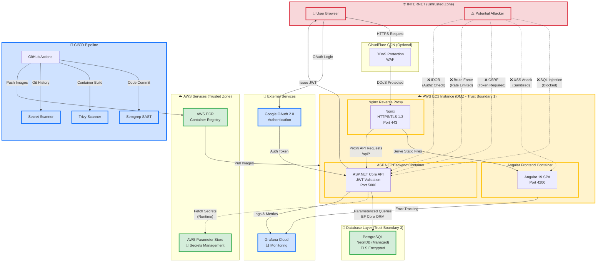
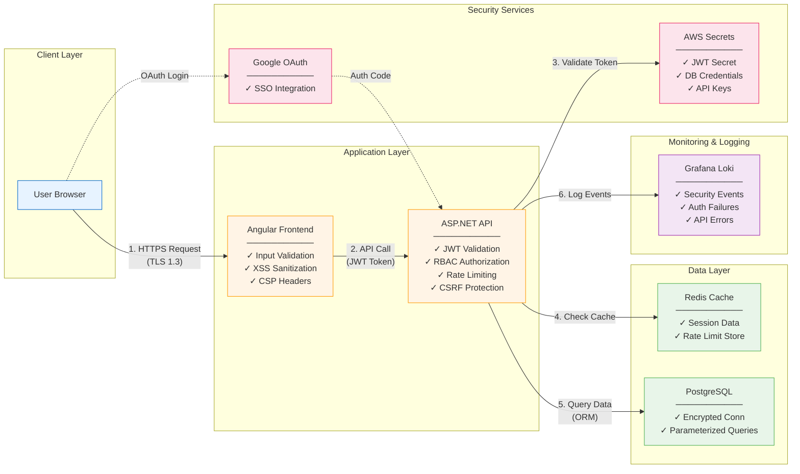
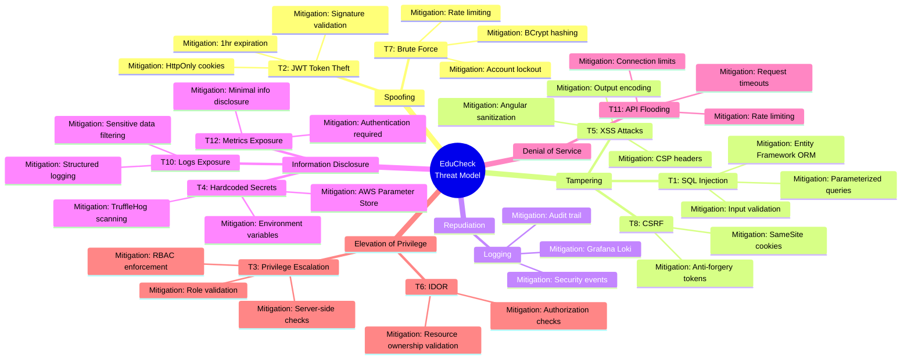
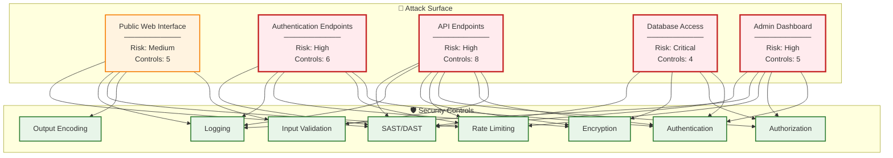
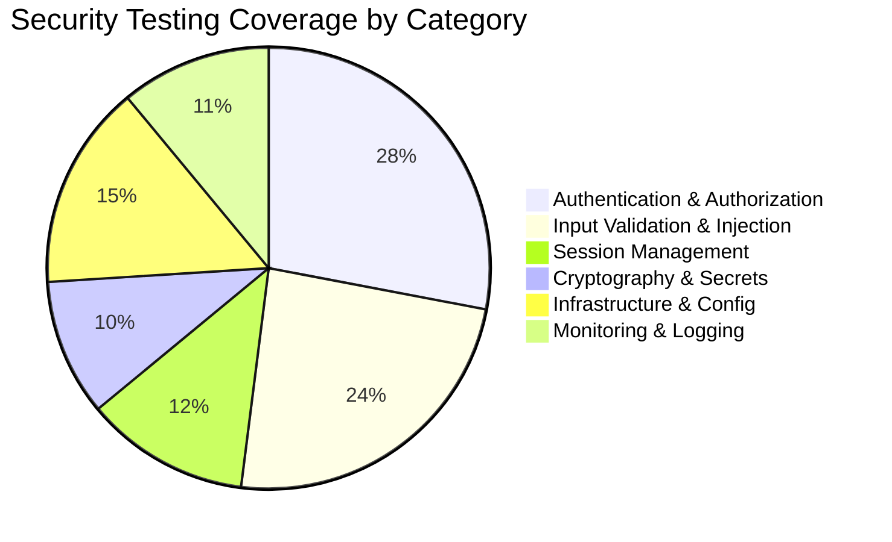
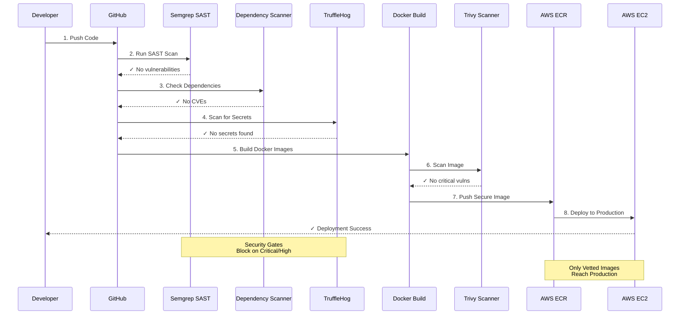

# EduCheck Security Architecture Diagrams

This document contains comprehensive architecture diagrams showing EduCheck's security controls, trust boundaries, and threat mitigation strategies.

---

## System Architecture with Trust Boundaries

---

## Data Flow Diagram with Security Controls

---

## Threat Model STRIDE Mapping

---

## Attack Surface Analysis

---

## Security Testing Coverage

---

## Deployment Security Pipeline

---

## How to Use These Diagrams

### In Your Documentation

These diagrams support the comprehensive security documentation in this repository:

- **[System Architecture](THREAT-MODEL.md#system-overview)** - Shows trust boundaries and component interactions
- **[Data Flow](THREAT-MODEL.md#security-controls-by-layer)** - Illustrates security controls at each layer
- **[STRIDE Mapping](THREAT-MODEL.md#identified-threats)** - Visual representation of all 12 threats and mitigations
- **[Attack Surface](THREAT-MODEL.md#risk-assessment-matrix)** - Risk levels and control coverage
- **[Testing Coverage](THREAT-MODEL.md#security-testing-results)** - Distribution of 89 security tests
- **[Deployment Pipeline](THREAT-MODEL.md#mitigation-status)** - 10-stage security scanning process

### For Interviews and Presentations

Use these diagrams when discussing:
- System architecture and design decisions
- Defense-in-depth security strategy
- Threat modeling methodology (STRIDE)
- CI/CD security integration
- Risk assessment and prioritization

---

## Additional Resources

- **[Complete Threat Model](THREAT-MODEL.md)** - Detailed analysis of all 12 threats
- **[Security Policy](../SECURITY.md)** - Vulnerability reporting guidelines
- **[Project README](../README.md)** - Overview and security highlights

---

**Last Updated:** March 2026  
**Maintained by:** Vuyisile Lehola